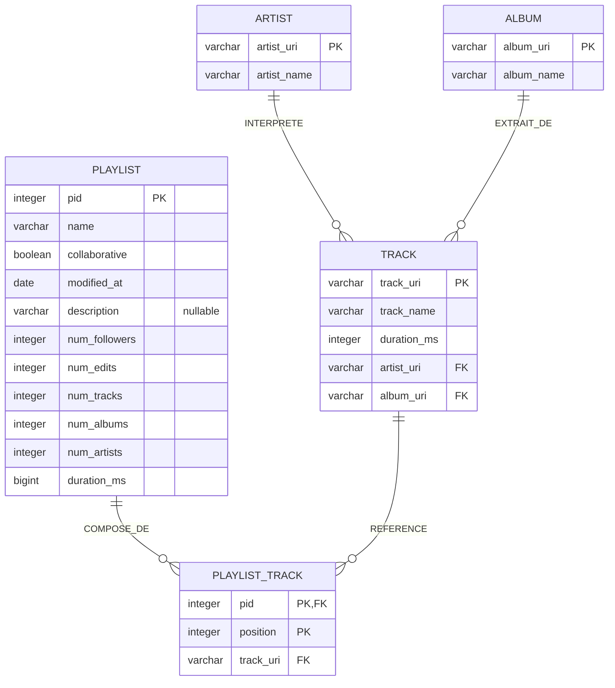

# Modèle de données — Spotify Million Playlist Dataset

Projet BI & Analytics — passage d'une archive JSON à un schéma relationnel interrogeable
(première étape avant un data warehouse).

| Livrable | Fichier |
|---|---|
| Analyse structurelle | ce document, §1 |
| MCD / MLD / MPD | ce document, §2 à §4 + `db/schema.sql` |
| Diagrammes dbdiagram.io (DBML) | `db/schema.dbml` (relationnel) · `db/warehouse_star.dbml` (cible entrepôt) |
| Script de transformation JSON → base | `db/load_mpd.py` + `db/build.sql` |
| Base construite | `db/mpd.duckdb` (DuckDB) |

---

## 1. Analyse des données

### 1.1 Source

Archive de **1000 fichiers** `data/mpd.slice.<a>-<b>.json`. Chaque fichier :

```jsonc
{
  "info": { "generated_on": "...", "slice": "0-999", "version": "v1" },
  "playlists": [
    {
      "pid": 0, "name": "Throwbacks", "collaborative": "false",
      "modified_at": 1493424000, "num_followers": 1, "num_edits": 6,
      "num_tracks": 52, "num_albums": 47, "num_artists": 37,
      "duration_ms": 11532414,
      "description": "…",                 // présent dans ~2 % des playlists seulement
      "tracks": [
        { "pos": 0,
          "track_name": "Lose Control (feat. Ciara & Fat Man Scoop)",
          "track_uri":  "spotify:track:0UaMYEvWZi0ZqiDOoHU3YI",
          "artist_name":"Missy Elliott",
          "artist_uri": "spotify:artist:2wIVse2owClT7go1WT98tk",
          "album_name": "The Cookbook",
          "album_uri":  "spotify:album:6vV5UrXcfyQD1wu4Qo2I9K",
          "duration_ms": 226863 }
      ]
    }
  ]
}
```

### 1.2 Volumétrie (mesurée sur les 1000 fichiers)

| Objet | Cardinalité |
|---|---|
| Playlists | **1 000 000** |
| Lignes « piste dans une playlist » (playlist × position) | **66 346 428** |
| Tracks distincts (`track_uri`) | **2 262 292** |
| Artistes distincts (`artist_uri`) | **295 860** |
| Albums distincts (`album_uri`) | **734 684** |

### 1.3 Attributs & domaines observés

**Playlist** — 11 champs toujours présents, 1 optionnel :

| Champ | Domaine observé | Remarque |
|---|---|---|
| `pid` | 0 … 999 999 | identifiant global fourni, unique |
| `name` | texte | **non unique** |
| `collaborative` | `"true"` / `"false"` | 2,3 % à `true` → booléen |
| `modified_at` | 1 271 376 000 … 1 509 494 400 | epoch **secondes** UTC, granularité **jour** → `2010‑04‑16` … `2017‑11‑01` |
| `description` | texte | **présent dans 1,9 % des playlists** → attribut nullable |
| `num_followers` | 0 … 71 643 (moy 2,6) | distribution très asymétrique |
| `num_edits` | 1 … 201 | |
| `num_tracks` | 5 … 376 (moy 66,3) | **toujours = `len(tracks)`** (0 écart) ; 0 playlist vide |
| `num_albums` | entier | = nb d'albums distincts de la playlist |
| `num_artists` | entier | = nb d'artistes distincts de la playlist |
| `duration_ms` | entier | = somme des durées des pistes |

**Piste** (élément de `tracks[]`) — 8 champs, **toujours tous renseignés** :
`pos`, `track_name`, `track_uri`, `artist_name`, `artist_uri`, `album_name`, `album_uri`, `duration_ms`.

### 1.4 Dépendances fonctionnelles (vérifiées sur les 66 M lignes)

| Test | Résultat | Conséquence |
|---|---|---|
| `track_uri` → (`artist_uri`, `album_uri`, `track_name`, `duration_ms`) | **0 incohérence** | `track_uri` est une clé propre : une entité **TRACK** aux attributs stables |
| `artist_uri` → `artist_name` | **0 incohérence** | entité **ARTIST** `(artist_uri, artist_name)` |
| `album_uri` → `album_name` | **0 incohérence** | entité **ALBUM** `(album_uri, album_name)` |
| `album_uri` → `artist_uri` | **38 235 albums multi‑artistes** (compilations) | **ALBUM ne porte pas** de clé étrangère vers ARTIST ; le lien artiste est porté par **TRACK** |
| `(pid, pos)` dupliqué ? | **jamais** | clé d'association = `(pid, position)` |
| `pos` continu (0…n‑1) ? | **oui, dense**, aucun trou | `position` = simple rang |
| Même `track_uri` deux fois dans une playlist ? | **881 652 cas** | la clé de l'association **doit inclure `position`** — `(pid, track_uri)` ne suffit pas |

### 1.5 Décisions de modélisation

1. **4 entités** : `PLAYLIST`, `TRACK`, `ARTIST`, `ALBUM` — toutes identifiées par leur URI Spotify.
2. **Clés primaires = identifiant base62 court** (22 caractères, partie après le dernier `:` de l'URI),
   dans des colonnes nommées `*_uri` (`artist_uri`, `album_uri`, `track_uri`) — mêmes noms que
   les champs de la source. L'URI complète reste reconstructible : `'spotify:track:' || track_uri`.
3. **Association `PLAYLIST_TRACK`** portant `position`, identifiée par `(pid, position)`
   (entité faible : identification relative à `PLAYLIST`).
4. **ALBUM sans FK artiste** (compilations) — la relation artiste ↔ album se déduit via `TRACK`.
5. **Agrégats de playlist conservés** (`num_tracks`, `num_albums`, `num_artists`, `duration_ms`) :
   déjà calculés à la source, cohérents à 100 % avec le détail, très commodes pour l'analyse.
   Dénormalisation assumée et documentée.
6. **Normalisation 3NF** pour cette étape ; l'évolution en schéma en étoile est prévue (§7).

---

## 2. MCD — Modèle Conceptuel de Données

### 2.1 Diagramme (entités / associations)



### 2.2 Cardinalités (notation Merise `(min, max)`)

| Association | Entité A | Card. A | Entité B | Card. B | Attribut porté |
|---|---|---|---|---|---|
| **INTERPRETE** | `TRACK` | (1, 1) | `ARTIST` | (0, n) | — |
| **EXTRAIT_DE** | `TRACK` | (1, 1) | `ALBUM` | (0, n) | — |
| **FIGURE_DANS** | `PLAYLIST` | (1, n) | `TRACK` | (0, n) | `position` |

Lecture :
- un `TRACK` a **exactement un** artiste principal et **exactement un** album ;
- un `ARTIST` / un `ALBUM` peut n'être rattaché à aucun ou à plusieurs tracks ;
- une `PLAYLIST` contient **au moins un** track (5 minimum dans les données) ;
- un `TRACK` peut figurer dans **0 à n** playlists.

**Cas de `FIGURE_DANS`.** Le couple `(PLAYLIST, TRACK)` peut se répéter (un même titre
placé plusieurs fois dans la même playlist). Une association binaire classique, dont
les occurrences sont identifiées par le couple des identifiants, ne peut pas porter ces
doublons. On la traite donc comme une **entité faible `PLAYLIST_TRACK`**, en
**identification relative** à `PLAYLIST` par l'attribut `position` :

```
PLAYLIST (1,n) ──< APPARTIENT (1,1) ── PLAYLIST_TRACK ── (1,1) REFERENCE >── (0,n) TRACK
                                        { identifiant : PLAYLIST + position }
```

---

## 3. MLD — Modèle Logique de Données (relationnel)

Notation : `PK` souligné conceptuellement, `#` = clé étrangère.

```
ARTIST (artist_uri, artist_name)
    PK (artist_uri)

ALBUM (album_uri, album_name)
    PK (album_uri)

TRACK (track_uri, track_name, duration_ms, #artist_uri, #album_uri)
    PK (track_uri)
    FK (artist_uri) → ARTIST(artist_uri)
    FK (album_uri)  → ALBUM(album_uri)

PLAYLIST (pid, name, collaborative, modified_at, description,
          num_followers, num_edits, num_tracks, num_albums, num_artists, duration_ms)
    PK (pid)

PLAYLIST_TRACK (#pid, position, #track_uri)
    PK (pid, position)
    FK (pid)      → PLAYLIST(pid)
    FK (track_uri) → TRACK(track_uri)
```

Contraintes complémentaires :
- `PLAYLIST.name`, `PLAYLIST.collaborative`, `PLAYLIST.modified_at`, tous les `num_*`
  et `duration_ms` : `NOT NULL` ; `PLAYLIST.description` : `NULL` autorisé.
- `TRACK.*`, `ARTIST.*`, `ALBUM.*` : `NOT NULL`.
- `PLAYLIST_TRACK.position ≥ 0`.

---

## 4. MPD — Modèle Physique de Données (DuckDB)

DDL complet et exécutable : **`db/schema.sql`**.
Version dbdiagram.io (DBML) du même schéma : **`db/schema.dbml`** — à coller tel quel
sur <https://dbdiagram.io> pour obtenir le diagramme entités-relations
(export PNG/PDF/SQL disponible depuis le site).

Résumé des choix physiques :

| Élément logique | Type DuckDB | Justification |
|---|---|---|
| `*_uri` (artist/album/track) | `VARCHAR` | id base62 Spotify, 22 caractères |
| `pid`, `position`, `num_*` | `INTEGER` | valeurs ≤ 10⁶ |
| `track.duration_ms` | `INTEGER` | une piste : < 2,1 × 10⁹ ms |
| `playlist.duration_ms` | `BIGINT` | somme sur une playlist, marge de sécurité |
| `collaborative` | `BOOLEAN` | converti depuis `'true'`/`'false'` |
| `modified_at` | `DATE` | `epoch_ms(modified_at*1000)::DATE`, granularité jour |
| `description` | `VARCHAR` NULL | `NULLIF(TRIM(description),'')` |

Index :

| Index | Colonnes | Usage |
|---|---|---|
| *(PK)* `artist` / `album` / `track` / `playlist` | `*_uri` / `pid` | jointures, unicité |
| *(PK)* `playlist_track` | `(pid, position)` | ordre des pistes, unicité |
| `ix_track_artist_uri` | `track(artist_uri)` | « tracks d'un artiste » |
| `ix_track_album_uri` | `track(album_uri)` | « tracks d'un album » |
| `ix_playlist_track_track_uri` | `playlist_track(track_uri)` | « playlists contenant ce track » |

### 4.1 Volumétrie chargée (contrôlée)

| Table | Lignes |
|---|---|
| `artist` | 295 860 |
| `album` | 734 684 |
| `track` | 2 262 292 |
| `playlist` | 1 000 000 |
| `playlist_track` | 66 346 428 |

Contrôles de cohérence exécutés en fin de chargement (`load_mpd.py`) — tous **OK** :
`playlist.num_tracks` = `COUNT` réel ; intégrité référentielle
`playlist_track → track`, `track → artist`, `track → album`.

---

## 5. Chargement (JSON → base)

```bash
# 1. environnement (le module duckdb n'est pas dans le Python système)
python3 -m venv .venv
.venv/bin/pip install duckdb

# 2. construction complète  ->  db/mpd.duckdb   (~8 min, fichier ~19 Go)
.venv/bin/python db/load_mpd.py

# variantes
.venv/bin/python db/load_mpd.py -n 50          # 50 slices, pour itérer vite (~20 s)
.venv/bin/python db/load_mpd.py --fast         # sans FK / PK composite : + rapide, fichier ~3-4 Go
.venv/bin/python db/load_mpd.py --db /tmp/x.duckdb --data data
```

Chaîne : `load_mpd.py` exécute `schema.sql` (structure) puis `build.sql` (ETL).
`build.sql` lit les fichiers via `read_json()` (glob), déplie `playlists` puis
`tracks` (`unnest(..., recursive := true)`), dérive les `*_uri` (id base62) par
`split_part(uri, ':', 3)`, alimente les dimensions en `INSERT … SELECT DISTINCT`,
puis `playlist` et `playlist_track`, et supprime le staging.

Requête interactive ensuite :

```bash
.venv/bin/python -c "import duckdb; con=duckdb.connect('db/mpd.duckdb', read_only=True); \
  print(con.sql('SELECT count(*) FROM playlist_track'))"
# ou, si le CLI duckdb est installé :   duckdb db/mpd.duckdb
```

---

## 6. Exemples de requêtes

```sql
-- 6.1  Combien de fois apparaît Beyoncé dans les playlists ? (feat exclus,
--      c.-à-d. Beyoncé = artiste principal)   -> 230 857 / 97 468
WITH b AS (SELECT track_uri FROM track WHERE artist_uri = '6vWDO969PvNqNYHIOW5v0m')
SELECT count(*)               AS occurrences,
       count(DISTINCT pid)    AS playlists
FROM playlist_track WHERE track_uri IN (SELECT track_uri FROM b);

-- 6.2  Top 3 des artistes présents dans les playlists où figure Beyoncé
WITH bp AS (
    SELECT DISTINCT pt.pid
    FROM playlist_track pt JOIN track t USING (track_uri)
    WHERE t.artist_uri = '6vWDO969PvNqNYHIOW5v0m'
)
SELECT a.artist_name,
       count(DISTINCT pt.pid) AS playlists,
       count(*)               AS occurrences
FROM playlist_track pt
JOIN bp USING (pid)
JOIN track  t ON t.track_uri = pt.track_uri
JOIN artist a ON a.artist_uri = t.artist_uri
WHERE a.artist_uri <> '6vWDO969PvNqNYHIOW5v0m'
GROUP BY a.artist_name
ORDER BY playlists DESC
LIMIT 3;                        -- Rihanna, Drake, Kanye West

-- 6.3  Top 20 artistes du dataset (par nombre de playlists distinctes)
SELECT a.artist_name,
       count(DISTINCT pt.pid) AS playlists,
       count(*)               AS occurrences
FROM playlist_track pt
JOIN track  t ON t.track_uri  = pt.track_uri
JOIN artist a ON a.artist_uri = t.artist_uri
GROUP BY a.artist_name
ORDER BY playlists DESC
LIMIT 20;

-- 6.4  Titres les plus « playlistés »
SELECT t.track_name, a.artist_name, count(*) AS n
FROM playlist_track pt
JOIN track  t ON t.track_uri  = pt.track_uri
JOIN artist a ON a.artist_uri = t.artist_uri
GROUP BY t.track_name, a.artist_name
ORDER BY n DESC
LIMIT 20;

-- 6.5  Playlists les plus suivies
SELECT pid, name, num_followers, num_tracks
FROM playlist
ORDER BY num_followers DESC
LIMIT 20;

-- 6.6  Distribution de la taille des playlists (paliers de 25 titres)
SELECT (num_tracks / 25) * 25 AS palier_min, count(*) AS nb
FROM playlist
GROUP BY palier_min
ORDER BY palier_min;

-- 6.7  Artistes ayant le plus d'albums référencés
SELECT a.artist_name, count(DISTINCT t.album_uri) AS albums
FROM track t JOIN artist a USING (artist_uri)
GROUP BY a.artist_name ORDER BY albums DESC LIMIT 20;

-- 6.8  Playlists « workout » et leur durée moyenne
SELECT count(*) AS nb, avg(num_tracks)::INT AS pistes_moy,
       (avg(duration_ms) / 60000)::INT       AS minutes_moy
FROM playlist
WHERE lower(name) LIKE '%workout%';
```

---

## 7. Évolution prévue vers le data warehouse

Ce schéma relationnel est la **couche d'analyse immédiate**. Étapes suivantes :

- **Schéma en étoile** : table de faits `fact_playlist_track`
  (grain = une piste à une position dans une playlist), dimensions
  `dim_artist`, `dim_album`, `dim_track`, `dim_playlist`, `dim_date` (sur `modified_at`).
  Brouillon dbdiagram.io prêt à visualiser : **`db/warehouse_star.dbml`**.
- **`dim_date`** dédiée (année, mois, trimestre, jour de semaine) pour l'analyse temporelle.
- **Table pont** `bridge_album_artist` si l'analyse par album multi‑artistes devient nécessaire
  (aujourd'hui dérivable via `track`).
- **Agrégats matérialisés** : popularité artiste/titre, co‑occurrences, taille moyenne des playlists.
- **Enrichissement externe** (hors archive) : genres, pays, date de sortie, caractéristiques audio.
- **Historisation** (SCD) si de nouveaux extraits datés arrivent.
